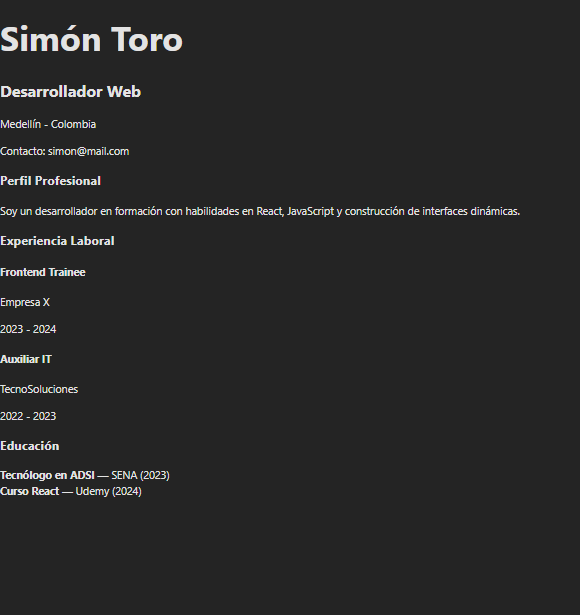

Proyecto React – Reutilización de Componentes (EV07)

Este proyecto forma parte de la actividad GA1-220501096-03-AA1-EV07 – Reutilización de Componentes en React, donde se aplican conceptos como props, desestructuración, componentes reutilizables y estructura modular en React.

Tecnologías Utilizadas

React 18

JavaScript ES6+

Vite (para entorno de desarrollo rápido)

CSS / Tailwind (si lo usaste)

Git & GitHub

Estructura del Proyecto
src/
├── components/
│ ├── Header.jsx
│ ├── Profile.jsx
│ ├── Card.jsx
│ └── Footer.jsx
├── App.jsx
├── main.jsx
└── assets/

Objetivo del Proyecto

El objetivo principal es crear componentes reutilizables usando props y desestructuración, organizando la interfaz en secciones claras:

Cabecera

Perfil del usuario

Tarjetas reutilizables (Cards)

Pie de página

Cada componente recibe información mediante props y puede repetirse varias veces sin duplicar código.

Componentes creados

1. Header.jsx

Componente encargado de mostrar el título o cabecera principal del proyecto.

2. Profile.jsx

Muestra información del usuario utilizando props como:

nombre

ocupación

imagen del perfil

3. Card.jsx

Componente reusable diseñado para mostrar contenido dinámico.
Se utiliza para múltiples secciones: información, tareas, enlaces, etc.

4. Footer.jsx

Cierre visual del sitio con información adicional.

🛠️ Instalación y ejecución

Sigue estos pasos para ejecutar el proyecto en tu equipo:

# 1. Clonar el repositorio

git clone https://github.com/simon-s-pizza/proyecto-angular-react-7.git

# 2. Entrar a la carpeta del proyecto

cd proyecto-angular-react-7

# 3. Instalar dependencias

npm install

# 4. Ejecutar el proyecto

npm run dev

Cómo reutilizar componentes

Ejemplo simple:

<Card
  titulo="Mi primera card"
  descripcion="Este componente es reutilizable mediante props."
/>

Vista previa del proyecto

Licencia

Este proyecto fue desarrollado con fines educativos para el SENA.
Puedes usarlo y modificarlo libremente.
